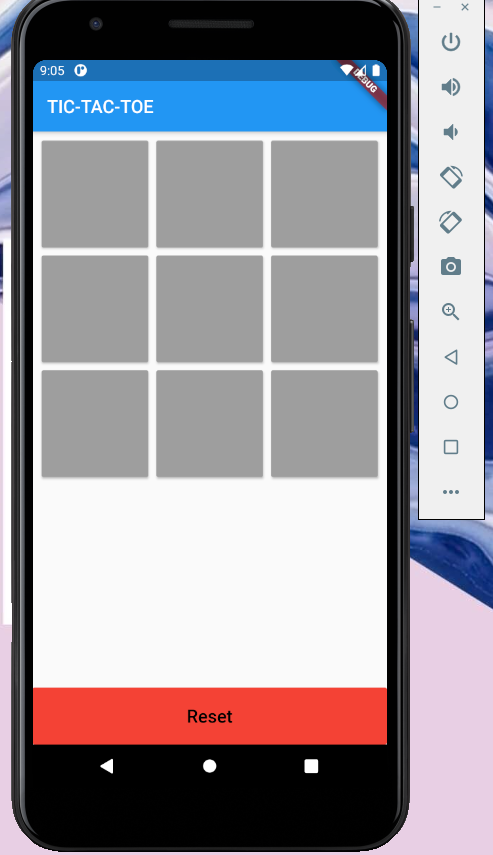
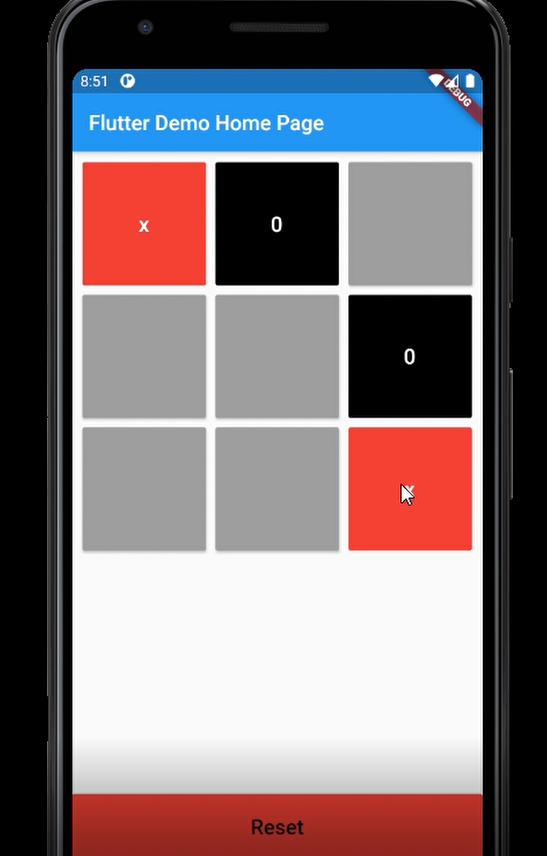
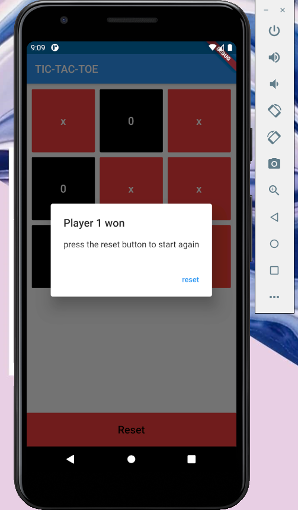

# Tic-Tac-Toe-Game-Flutter
This is a Tic Tac Toe game which i have build while i was learning to code in flutter. 
The application runs the basic tic-tac-toe game in a digital form. It enables the user to play the game against the computer in single player mode. Like every other game it has three parameters for result i.e. Win, Lose, Tie which are decided at the end of each game accordingly.

<b>Built Using</b>
<ul><li>Flutter</li></ul>

<b>Some Snaps from the app:-</b> 
  
 
 
 
 ## Show some ❤️ and star the repo to support the project.
 ### Getting Started
This project is a starting point for a Flutter application.
 
A few resources to get you started if this is your first Flutter project:
<ul>
 <li>
  <a href="https://flutter.dev/docs/get-started/codelab">Lab: Write your first Flutter app</a>
 </li>
 <li>
  <a href="https://flutter.dev/docs/cookbook">Cookbook: Useful Flutter samples</a>
 </li>
 </ul>
For help getting started with Flutter, view our <a href="https://flutter.dev/docs">online documentation</a>, which offers tutorials, samples, guidance on mobile development, and a full API reference.
